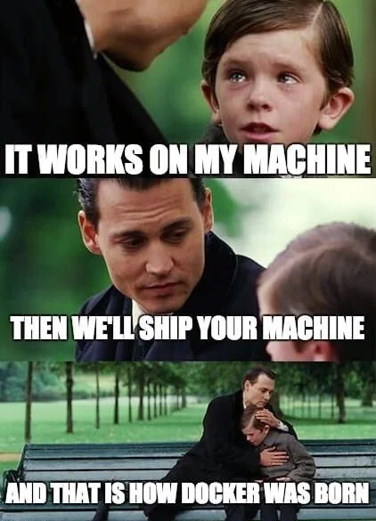

First, just understand how Docker works, [watch this video](https://www.youtube.com/watch?v=gAkwW2tuIqE).

There are only about 10 main ideas in Containers, and I highly recommend reading ["How Containers Work"](https://books.nuno.family/read/148/pdf) to understand them.

If you don't understand what I'm saying in this document, go read!

1. Containers Solve 2 Main Problems: Building Software and Deploying Software.

If you got the software to build and run on your own machine, wouldn't it be convenient to just package up the entire state of your machine and ship it to production so it runs on the production server, too? That's basically what Docker was invented to do.

2. Docker lets you specify EVERY dependency for a container, and their versions (including operating system, build system, programming languages, command line tools, and packages), and store it in a giant Tarball, called a "container image".

3. Container Images are built in this order when you run `docker build`:
- start with the base OS in the docker container
- then install program + dependencies
- then configure it
- then make a tarball of the WHOLE FILESYSTEM OF THAT COMPUTER

4. Images are run like this:
- download the tarball
- unpack it into a directory
- run a program and pretend that directory is its whole filesystem

5. A container is just a group of linux processes